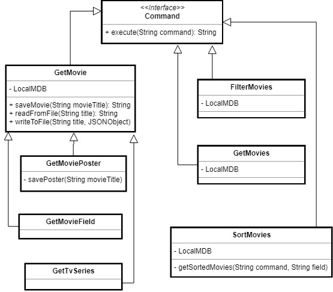
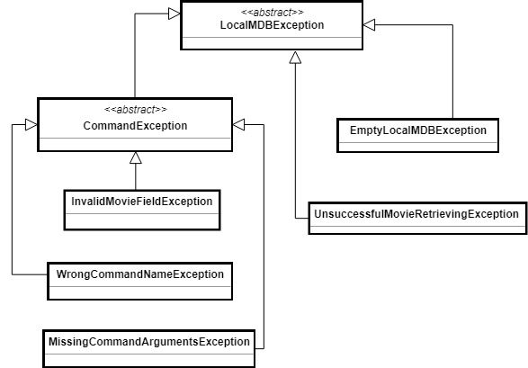

# Internet Movie Database search engine


## Задание

IMDb (или Internet Movie Database) представлява онлайн база данни за филми, сериали,
актьори и други. IMDb е най-големият 
сайт за въпросната тематика, като в него се
съхраняват над 2 милиона статии за филми и телевизионни сериали. Съществува
публичен
 програмен интерфейс [(API)](http://www.omdbapi.com/), чрез който тези данни могат да бъдат достъпвани
(безплатно до 1000 заявки на ден).
 Този интерфейс се нарича OMDb API и бива използван за целта на този
проект.


### **Movie Database Portal**
* Да се имплементира многонишков сървър, който приема команди от потребители и връща резултата от тяхното изпълнение.

* Да се имплементира клиент, който праща командите си към сървъра.

* Приложението извлича необходимите му данни от OMDb API-то по HTTP и запазва
(кешира) резултата в локалната файлова система. 
Например, при получаване на
командата get-movie Titanic, сървърът прави HTTP GET заявка към
http://www.omdbapi.com/?t=Titanic (OMDb API-то)
 и получава HTTP response със
статус код 200 и с тяло следния JSON:


```

	{
		"Title": "Titanic",
		
        	"Year": "1997",

		"Rated": "PG-13",…
	}


```


Приложението записва получения JSON във файл на локалната файлова система, като
създава нов файл за всеки филм.

* При получаване на заявка, приложението първо трябва да провери дали в кеша вече
съществува файл с подаденото име за филм и ако е така, 
директно да върне
съдържанието на файла, вместо да направи нова заявка към OMDb.


### **Команди**

Да се имплементират командите: 

* **get-movie [movie_name]** - принтира информация за филма с даденото
заглавие (<movie_name>) в четим формат (например като JSON).

* **get-movie-fields [movie_name] fields= [field_1, field_2]** - принтира подадените полета (fields) на филма с даденото
заглавие (<movie_name>) в четим формат.

* **get-movie-poster [movie_name]** - сваля
изображението от полето Poster за подадения филм в локалната файлова
система, след което като резултат се връща името на файла с изображението.

* **get-movies** - принтира заглавията на всички филми в локалната база за филми.

* **sort-movies [field] [desc]** - сортира филмите в локалната база за филми по подането поле (field). Филмите по подразбиране се сортират във възходящ ред, а ако *desc* е подаден като част от командата, то те биват сортирани в низходящ ред.

* **filter-movies [field]= [field_value]** - филтрира филмите в локалната база за филми по дадено поле (field).

* **get-tv-series [tv_series_name] season= [number_of_season]** - 
която принтира информация за епизодите на сериал за подадения сезон.


## Дизайн и имплементация

#### Команди
Приложението е имплементирано с *Strategy pattern* отностно командите. Всяка команда си има свой клас, който имплементира
общия интерфейс **Command**, притежаващ **execute** метод. Командите *get-movie-fields*, *get-movie-poster* и *get-tv-series* наследяват
основната команда *get-movie*, защото преди да се получи информация за дадено поле, плакат или епизоди на сериал, даденият филм или
сериал трябва да бъде добавен в локалната база от филми посредством методите на get-movie.
Следната UML клас диаграма изобразява връзките между класовете:
<p align="center">
  
</p>


#### Изключения
**execute** методът на всяка команда хвърля **LocalMDBException**, което е абстрактен клас, наследен от **EmptyLocalMDBException** *(хвърля се когато
локалната база е празна, а е извикана команда изискваща вече запазени филми)*, **UnsuccsessfulMovieRetrievingException** *(хвърля се когато има проблем
със свалянето на информация за някой филм, било то такъв възникнал по време на четене/записване във файл, парсване на json обектите или изпращането/получаването 
на информация от OMDB api-то)* и **CommandException**. Последният също е абстрактен клас, който обединява всички изключения, които са свързани с въведените от потребителя
команди, като **InvalidMovieFieldException** *(хвърля се когато е въведено невалидно поле за филм)*, **WrongCommandNameException** *(хвърля се когато е въведено
некоректно име на командата)* и **MissingCommandArgumentsException** *(хвърля се когато дадена команда има по-малко на брой аргументи)*. Когато се хвърли някое изключение
на конзолата се изписва подходящо съобщение за грешка и потребителят може да въведе наново команда.
На дадената UML клас диаграма връзките между класовете са изобразени по-ясно:

<p align="center">
  
</p>

